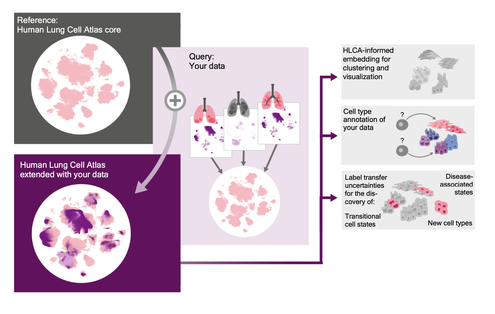

## Mapping your data to the Human Lung Cell Atlas
This repository enables you to map your own single-cell or single-nucleus data to the Human Lung Cell Atlas.

### What is the HLCA?
The Human Lung Cell Atlas (HLCA) is an integration of 46 different datasets of the lung and nose. The HLCA core reference, containing a subset of those 46 datasets,  was built by integrating data from 107 individuals and 14 datasets, and then re-annotating all cells in a consensus manner based on originally published labels and inputs from 6 experts.

### Why map my data to the HLCA?
Mapping your own lung single-cell or single-nucleus data to the HLCA will greatly speed up the analysis of your dataset. Upon mapping we can project consensus labels from the HLCA to your data and, using mapping uncertainty, highlight which cells seem different from healthy cells in the atlas. Depending on your experimental setup, these cells might represent novel cellular identities or cells particularly affected by disease.

### How can I map my data to the HLCA?
In this repository we provide the code need to map your data to the HLCA. You can map your own single-cell or single-nucleus RNA-sequencing data to the HLCA reference. Mapping to the HLCA is done with scArches, a transfer-learning tool designed for mapping new data to large references. Note that you'll need access to GPU to perform the mapping. If you do not want to map the data on your own computing resources, you can also do automated mapping on [FastGenomics](https://beta.fastgenomics.org/analyses/detail-analysis-d85cb82af90d42bd9bc3086c1dc035c1#Result&scArches). 

There are a few things to prepare before starting the mapping. This information is also included in the analysis notebook you'll use.
- Install the right packages. The easiest way to do this is to install our prepared conda environment in [./envs/scarches_mapping_conda_env.yml](./envs/scarches_mapping_conda_env.yml). Just cd into the envs folder after cloning our repository, and run `conda env create -f scarches_mapping_conda_env.yml`. If you don't want to use conda, just make sure you have [scArches](https://pypi.org/project/scArches/0.3.5/) v.0.3.5, scvi-tools 0.8.1 and torch>=1.3,<=1.8.0 installed. 
- You'll need access to a GPU to run this script efficiently, on CPU it will be very slow if it manages to run at all. We ran the script with the provided test data in less than an hour (~half of which is umap calculation), on a node with 4 cores, needing only 9GB of memory. With bigger datasets you'll need more.
- Ensure your data is in h5ad format, the standard format used in [scanpy](https://scanpy.readthedocs.io/en/stable/).
- Make sure your .X layer has raw counts (i.e. integers, so no normalization, no log-transformation)
- Make sure to specify your batch variable under `adata.obs[“dataset”]`. If your data comes from a single batch, you can simply set all data to e.g. “batch_1" by running `adata.obs[“dataset”] = “batch_1”`. Note that we do *not* recommend using subjects as batches. Rather, treat your dataset as one batch, unless there are subsets that differ in terms of experimental protocol (e.g. 5' versus 3' sequencing, or single-nucleus versus single-cell, or 10Xv1 versus v2 etc.). We also do not recommend treating disease status as a batch variable, as this might remove disease-specific effects from the embedding.

To do the mapping, clone this repository and simply follow the steps in the jupyter notebook "LCA_scArches_mapping_new_data_to_hlca", which you can find in the notebooks folder of this repository.

For more information on the metadata categories of the HLCA (e.g. cell type, subject age, sequencing platform), check out our [metadata explanations](./docs/HLCA_metadata_explanation.csv) in the docs folder.

### References
HLCA: [Sikkema et al., bioRxiv 2022](https://www.biorxiv.org/content/10.1101/2022.03.10.483747v1), doi:10.1101/2022.03.10.483747 
scArches: [Lotfollahi et al., Nature Biotechnology 2021](https://www.nature.com/articles/s41587-021-01001-7), doi:10.1038/s41587-021-01001-7 

### In case of problems:
Submit an issue on this GitHub repository.
